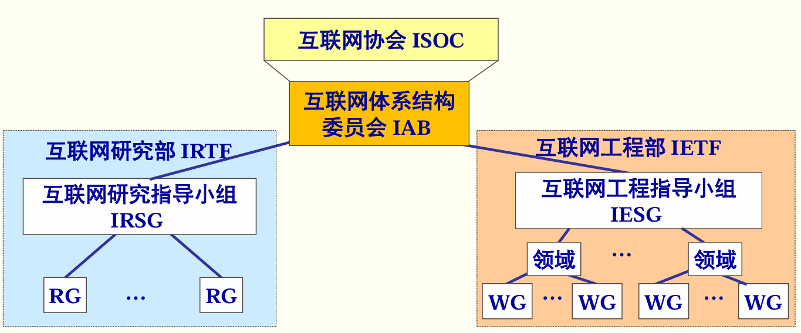
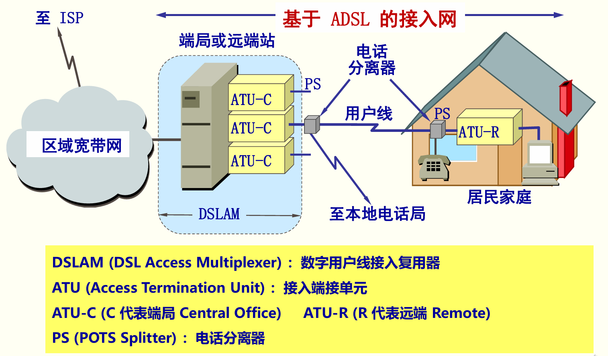

>大部分情况下，P--协议，C--控制，T--传输
---
# 第一章
1. ISP：网络服务提供者
2. IXP：互联网交换点
3. 
4. **RFC**：请求评论
5. end system：端系统（即主机）
6. Client/Server 方式，简称为 C/S 方式：客户-服务器方式
7. Peer-to-Peer 方式 ，简称为 P2P 方式：对等方式
8. router：路由器
9. packet switching：分组交换
10. packet：分组
11. message switching：报文交换
12. WAN (Wide Area Network)：广域网
13. MAN (Metropolitan Area Network)：城域网
14. **LAN**(Local Area Network) ：局域网
15. **PAN** (Personal Area Network) ：个人区域网
16. public network ：公用网
17. private network：专用网
18. **AN** (Access Network)：接入网
19. **SNA**（System Network Architecture）：系统网络体系结构
20. **OSI/RM**(Open Systems Interconnection Reference Model)：开放系统互连基本参考模型
21. Application Layer：应用层
22. Transport Layer：运输层
23. **TCP**（Transport Control Protocol）：传输用户协议
24. **UDP**（User Datagram Protocol）：用户数据报协议
25. Network Layer ：网络层
26. Data Link Layer：数据链路层
27. Physical Layer：物理层
28. **PDU** (Protocol Data Unit)：协议数据单元
29. peer layers：对等层

# 第二章
1. procedure：规程
2. **bandwidth**：带宽
3. twisted-pair：双绞线
4. **UTP**：无屏蔽双绞线
5. **STP**：屏蔽双绞线
6. ISM（Industrial Scientific and Medical）工业、科学与医药
7. **USB**（Universal Serial Bus）：通用串行总线
8. **NRZI**：不归零反向码
9. multiplexing：复用
10. **FDM**(Frequency Division Multiplexing)：频分复用
11. **TDM** (Time Division Multiplexing) ：时分复用
12. **STDM**(Statistic TDM) ：统计时分复用
13. **WDM**(Wavelength Division Multiplexing) ：波分复用
14. **CDM**：码分复用
15. **CDMA**(Code Division Multiple Access)：码分多址
16. chip sequence：码片序列
17. ***ADSL***(Asymmetric Digital Subscriber Line):非对称数字用户线
18. 
19. HFC (Hybrid Fiber Coax)网 :光线同轴混合网
20. UIB (User Interface Box)：接口盒
21. (set-top box)：机顶盒
22. **FTTx**（Fiber To The…） ：光纤到…    
    FTTH (Fiber To The Home)：光纤到户
    FTTB (Fiber To The Building)：光纤到大楼
    FTTC (Fiber To The Curb)：光纤到路边
23. **PON**(Passive Optical Network)：无源光网络

# 第三章
1. framing：帧
2. **MTU**（maximum transformation uinit）：最大传输单元
3. **BER** (Bit Error Rate)：误码率
4. **CRC**(Cyclic Redundancy Check)：循环冗余校验
5. **FCS** (Frame Check Sequence)：帧检验序列
6. **PPP** (Point-to-Point Protocol)：点对点协议
7. LCP (Link Control Protocol)：链路控制协议
8. NCP (Network Control Protocol)：网络控制协议
9. **LLC**(Logical Link Control)：逻辑链路控制
10. **MAC** (Medium Access Control)：媒体接入控制
11. **NIC** (Network Interface Card)：网络接口卡
12. **CSMA/CD**(Carrier Sense Multiple Access with Collision Detection) ：载波监听多点接入/ 碰撞检测 
13. hub：集线器
14. PPPoE (PPP over Ethernet) ：在以太网上运行 PPP

# 第四章
1. **ARP**(Address Resolution Protocol)：地址解析协议
2. **ICMP**(Internet Control Message Protocol)：网际控制报文协议
3. **IGMP**(Internet Group Management Protocol)：网际组管理协议
4. repeater:转发器
5. bridge:网桥或桥接器
6. router:路由器
7. gateway:网关
8. ICANN (Internet Corporation for Assigned Names and Numbers):互联网名字和数字分配机构
9. **TTL** (Time To Live)：生存时间
10. **CIDR**(Classless Inter-Domain Routing)：无分类域间路由选择
11. **VLSM** (Variable Length Subnet Mask)：变长子网掩码 
12. ***PING*** (Packet InterNet Groper)：分组网间探测
13. Autonomous Systems (**AS**)：自治系统
14. ***IGP*** (Interior Gateway Protocol) ：内部网关协议
15. **EGP** (External Gateway Protocol)：外部网关协议
16. BGP：外部网关协议
17. ***RIP*** (Routing Information Protocol) ：路由信息协议
18. **OSPF** (Open Shortest Path First)：开放最短路径优先
19. SPF：最短路径优先
20. **MBONE**(Multicast Backbone On the InterNEt)：多播主干网
21. **VPN** (Virtual Private Network)：虚拟专用网
22. ***NAT*** (Network Address Translation) ：网络地址转换
23. **NAPT**(Network Address and Port Translation)：网络地址与端口号转换

# 第五章
1. ***ARQ*** (Automatic Repeat reQuest)：自动重传请求
2. ***RTT***(round-trip time)：往返时间
3. ***MSS***(Maximum Segment Size):最大报文段长度
4. ***SACK*** (Selective ACK) ：选择确认

# 第六章
1. **DNS** (Domain Name System)：域名系统 
2. **TLD**(Top Level Domain)：顶级域名
3. **NFS**（Network File System）：网络文件系统
4. **FTP** (File Transfer Protocol) ：文件传送协议
5. TFTP (Trivial File Transfer Protocol) ：简单文件传送协议
6. **NVT**：网络虚拟终端
7. WWW (World Wide Web)：万维网 
8. **URL** (Uniform Resource Locator)：统一资源定位符
9. **HTTP**(HyperTextTransfer Protocol)：超文本传送协议
10. **HTML**(HyperTextMarkupLanguage)：超文本标记语言
11. XML(Extensible Markup Language)：可扩展标记语言
12. XHTML (Extensible HTML) ：可扩展超文本标记语言
13. ***CSS*** (Cascading Style Sheets) ：层叠样式表
14. CGI(Common Gateway Interface)：通用网关接口
15. SNS (Social Networking Site) ：社交网站
16. **SMTP**（简单邮件传送协议）：发送邮件的协议
17. **POP3**：邮局协议
18. ***IMAP*** (Internet Message Access Protocol) ：网际报文存取协议
19. ***MIME***(Multipurpose Internet Mail Extensions)：多用途互联网邮件扩展
20. **DHCP** (Dynamic Host Configuration Protocol)：动态主机配置协议
21. ***SNMP***：简单网络管理协议
22. SMI(Structure of Management Information)：管理信息结构
23. MIB (Management Information Base)：管理信息库
24. **API**(Application Programming Interface)：应用编程接口 
25. TLI (Transport Layer Interface)：运输层接口
---

